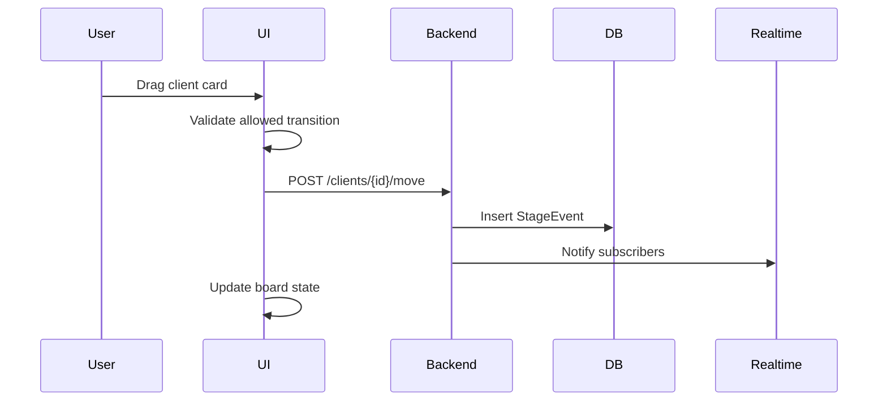
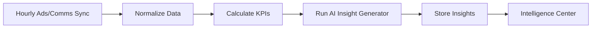
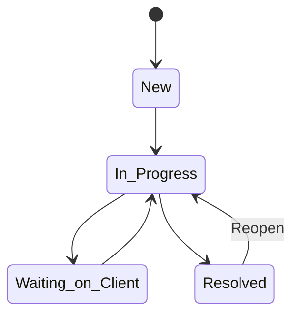
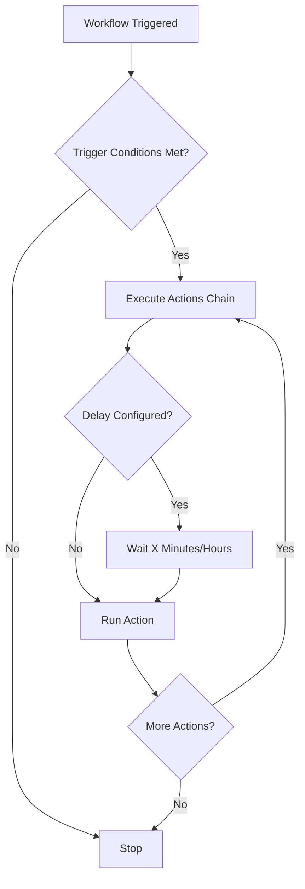
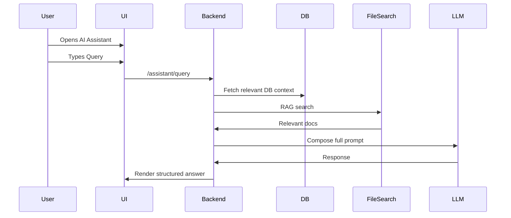

# Chase's Original FSD (Source Document)

> **Imported from Drive:** 2025-12-31
> **Original Location:** AudienceOS/Project Documents & Design (Markdown)/Functional Requirements Doc.md
> **Author:** Chase (client)

---

# **Functional Specifications Document (FSD)**

# **Diiiploy Command Center**

*Single-Tenant SaaS for Marketing Agencies*

---

# **0. Document Purpose**

This Functional Specifications Document defines the **precise behavior** of the AudienceOS Command Center SaaS platform. It provides:

* System behavior
* UI/UX behavior
* Validation rules
* State transitions
* Integration rules
* AI assistant behavior
* Workflow automation logic
* Error handling
* Permissions
* Non-functional requirements
* Acceptance criteria
* Diagrams for major flows

This document is intended for:

* Engineering
* QA
* Product
* DevOps
* Design

---

# **1. System Overview**

AudienceOS is a **single-tenant workspace-per-agency** SaaS platform for marketing agencies. It centralizes:

* Pipeline management
* Client lifecycle
* Support tickets
* KPI insights
* Knowledge base
* Automation workflows
* Slack / Gmail / Ads integrations
* AI assistant with RAG + DB querying

Everything is designed around one core mission:

> **Help agencies manage clients efficiently and leverage AI to analyze data, summarize insights, and recommend actions.**

---

# **2. Roles & Permissions**

There are **four roles**:

## **2.1 Owner**

* Only you (the developer)
* Full permissions over everything
* Hidden from normal UI (for internal use)
* Can access system-level DevOps pages

## **2.2 Admin**

* Manage clients
* Manage integrations
* Manage automations
* Manage knowledge base
* Manage tickets
* Manage users
* Access all analytics
* Approve AI-generated actions

## **2.3 User**

* Manage assigned clients
* View pipeline
* Create/update tasks
* View analytics
* Use AI assistant
* Draft emails (review required)
* Cannot manage integrations
* Cannot edit automations

## **2.4 Agent (AI system role)**

* Never visible as a user
* Used internally to attribute AI-generated content
* Cannot perform actions without human approval

---

# **3. UI/UX Global Behaviors**

## **3.1 Loading States**

* Skeleton screens for all pages
* Loading indicators inside modals
* Buttons show "Loading…" with spinner

## **3.2 Error States**

**Soft Fail Model**

* No system blocks unless data is missing
* Banner warning appears at top of screen

Example banner:

> **Slack Sync Failed** (Transient) — Retrying in background.

## **3.3 Confirmations**

* "Are you sure?" dialog for destructive actions

  * Delete client
  * Delete automation
  * Remove integration

## **3.4 General Form Rules**

* Required fields glow red on validation failure
* Disabled primary action until valid
* Text areas auto-expand
* Autosave drafts for long-form fields (notes, descriptions)

---

# **4. Screens & Functional Specifications**

Below are all major screens with detailed UI & functional behaviors.

---

# **4.1 Dashboard**

## **4.1.1 Components**

* Active Onboardings (count)
* At-Risk Clients (count)
* Support Hours This Week
* Average Install Time
* Progress chart (New vs Completed installs)
* Clients Needing Attention (AI curated list)

## **4.1.2 Behavior**

* Data refreshes hourly
* Manual "Refresh Data" button triggers on-demand fetch
* Clicking a metric navigates to a filtered Client List view

## **4.1.3 Acceptance Criteria**

* Metrics must load within 3 seconds
* Clicking a KPI must pass applied filters as query params

---

# **4.2 Pipeline (Kanban Board)**

Stages:

1. Onboarding
2. Installation
3. Audit
4. Live
5. Needs Support
6. Off-Boarding

## **4.2.1 Client Card**

* Name
* Health (Green / Yellow / Red)
* Days in stage
* Owner
* Latest note preview

### On Hover

* Quick actions:

  * Open details
  * Add note
  * Assign user

## **4.2.2 Drag-and-Drop Behavior**

* Moving a card triggers a confirmation modal ONLY when moving into:

  * Needs Support
  * Off-Boarding

### **Validation Rules**

* Cannot move card backwards more than 2 stages (Admin override allowed)
* Must create a StageEvent record

## **Sequence Diagram: Pipeline Stage Movement**

---

# **4.3 Client Detail Drawer**

Tabs:

### 1. **Comms**

Aggregated Slack + Gmail threads sorted newest → oldest.

### 2. **Tasks (Checklists)**

* Stage-based task sets
* Checkmark updates immediately
* Tasks remain across stage movement unless explicitly cleared

### 3. **Performance**

* Graphs for Meta + Google Ads
* Time ranges: 7 / 14 / 30 days
* Shows:

  * ROAS
  * CPA
  * Spend
  * Clicks
  * Impressions
  * Conversions

### 4. **Media**

* Zoom recordings (v2)
* Searchable transcripts (when available)

---

# **4.4 Client List**

## **Columns**

* Client name
* Stage
* Owner
* Days in stage
* Tickets open
* Install time

## **Filtering**

* Stage
* Owner
* Health
* Search

## **Bulk Actions**

* Assign owner
* Move stage
* Mark healthy (Admin only)

---

# **4.5 Intelligence Center**

Sections:

* **Critical Risks**

  * Integration failures
  * KPI drop > threshold
  * No activity > threshold
* **Approvals & Actions**

  * AI-generated actions waiting for approval
* **Performance Signals**

  * Significant KPI changes

## **Insight Generation Pipeline**

---

# **4.6 Support Tickets**

Columns:

* New
* In Progress
* Waiting on Client
* Resolved

## **Ticket Requirements**

* Title
* Client
* Priority
* Assignee
* Description
* AI sentiment
* AI suggested fixes

## **4.6.1 Resolution Behavior**

When status = **Resolved**, enforce:

* Mandatory "Final Note"
* Optional checkbox **[ ] Send Client Summary Email**
* Button: **Reopen ticket**

## **Ticket Lifecycle Diagram**

---

# **4.7 Knowledge Base**

## **Categories**

* Installation
* Tech
* Support
* Process

## **Search**

* Full-text search
* Metadata filters
* RAG-based answer linking

---

# **4.8 Automations (IF/THEN Builder)**

## **4.8.1 Limits**

* Max triggers: **2**
* Max actions: **Unlimited chain**
* Support:

  * Conditional branching (IF X AND Y)
  * Delayed actions (0 min → 24 hours)

## **4.8.2 Automations Flow Diagram**

---

# **4.9 Integrations**

v1:

* Slack
* Gmail
* Google Ads
* Meta Ads

## **4.9.1 Sync Frequency**

* Hourly CRON
* On-demand "Sync Now" button

## **4.9.2 Slack**

* Pull last 30 days by default
* Fetch threads containing client name
* Store message metadata

## **4.9.3 Gmail**

* Thread-based sync
* Sentiment analysis per message

## **4.9.4 Ads**

Store normalized metrics per day:

* impressions
* clicks
* spend
* conversions
* revenue
* derived metrics ROAS & CPA

### KPI Rules

* **CPA with 0 conversions = 0**
* Missing data = flagged
* Negative data = flagged

---

# **5. AI Assistant**

The assistant performs:

* DB queries
* Document search (RAG)
* Draft emails
* Summaries
* Insight analysis

## **5.1 Prompt-Level Rules**

* Summaries must include:

  * KPI deltas
  * Risk factors
  * Stage-based next steps
* Draft emails must:

  * Use professional tone
  * Include client-specific data
  * Always require user confirmation

## **5.2 Sequence Diagram: AI Query**

---

# **6. Non-Functional Requirements**

## **6.1 Performance**

* Page loads < 3s
* AI responses < 8s
* Sync operations must not block UI

## **6.2 Reliability**

* Soft failures for integrations
* Automatic retries with backoff

## **6.3 Security**

* All integration tokens encrypted
* RLS enforced per tenant
* Admin-only destructive actions

## **6.4 Accessibility**

* All buttons must have ARIA labels (optional)

---

# **7. Acceptance Criteria (Cross-System)**

## **1. Pipeline**

* Moving a client between stages persists within 100ms
* Invalid transitions blocked with error tooltip

## **2. Tickets**

* Resolving requires final note
* Reopening moves back to In Progress

## **3. Ads KPIs**

* ROAS and CPA must compute correctly
* Flag missing attribution

## **4. Automations**

* Two triggers max enforced
* Unlimited chained actions supported
* Delay actions must fire reliably

## **5. AI Assistant**

* Summaries reference at least 2 sources
* Drafted emails follow tone rules
* No autonomous execution

---

# **8. End of Document**

---

*This is Chase's original source document. DO NOT MODIFY - use for reference only.*
