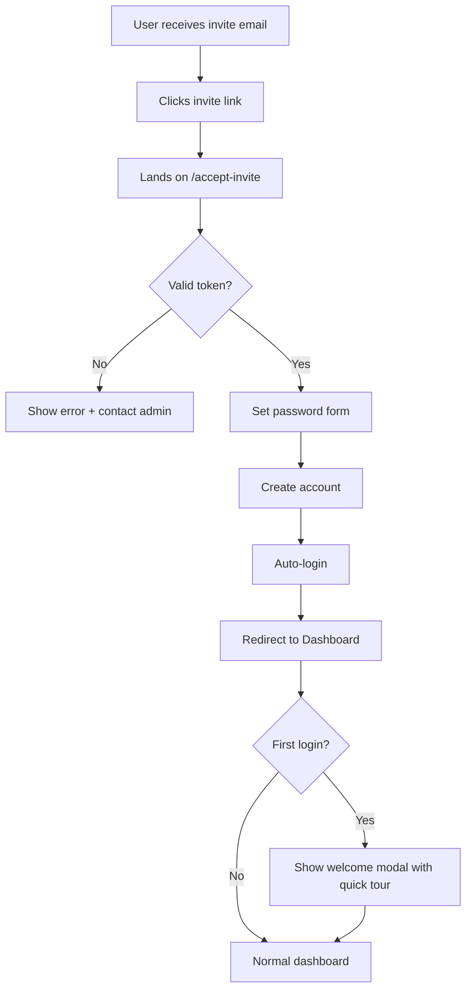
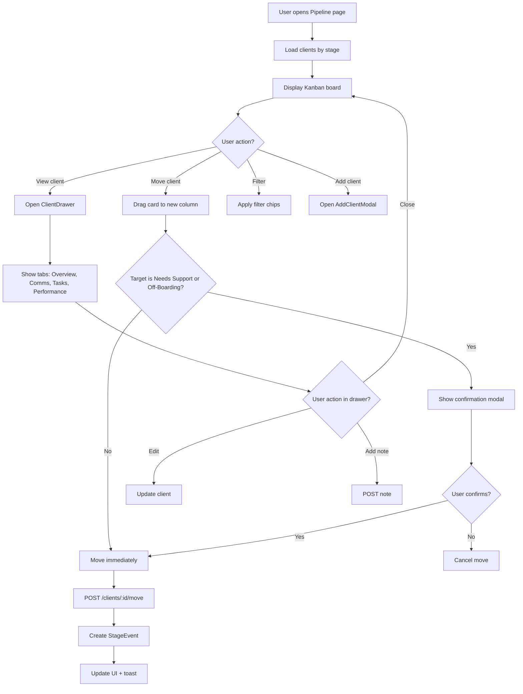
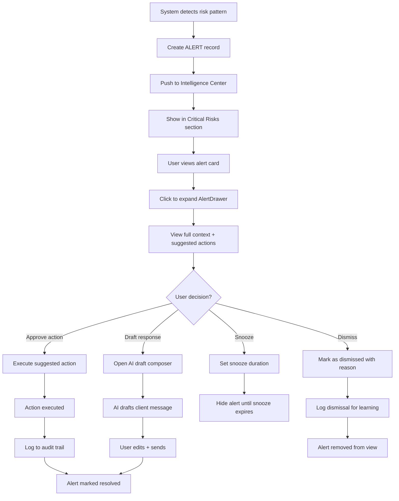
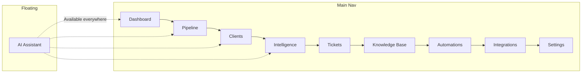

# UX Flows

> **Project:** AudienceOS Command Center
> **Created:** 2025-12-31
> **Source:** Feature specs + Chase's original FSD

---

## Overview

This document describes the primary user journeys through the application, including entry points, decision points, and exit states.

---

## Flow 1: First-Time Login & Onboarding



### Key States
- **Entry:** Email invitation link
- **Happy Path:** Password set → Dashboard with tour
- **Error State:** Expired/invalid token → Contact admin message

---

## Flow 2: Client Pipeline Management



### Key States
- **Entry:** Pipeline nav item or direct URL
- **Happy Path:** View board → Move client → Confirmation → Success toast
- **Interaction:** Drag-drop with confirmation for sensitive stages

---

## Flow 3: Unified Communications Timeline

```mermaid
flowchart TD
    A[User opens client drawer] --> B[Click Comms tab]
    B --> C[Load communications for client]
    C --> D[Display timeline: Slack + Gmail merged]

    D --> E{User action?}
    E -->|Filter by source| F[Toggle Slack/Gmail/All]
    E -->|Filter needs reply| G[Show only unresponded]
    E -->|Expand thread| H[Show full thread]
    E -->|Reply| I[Open ReplyComposer]

    I --> J{Use AI draft?}
    J -->|Yes| K[Click "Draft Reply"]
    J -->|No| L[Type manually]

    K --> M[AI generates draft from context]
    M --> N[Display draft in composer]
    N --> O[User edits draft]
    O --> P{Send or cancel?}

    L --> P
    P -->|Send| Q[POST to Slack/Gmail API]
    Q --> R[Optimistic update]
    R --> S{Success?}
    S -->|Yes| T[Show sent confirmation]
    S -->|No| U[Rollback + error toast]

    P -->|Cancel| D
```

### Key States
- **Entry:** Client drawer → Comms tab
- **Happy Path:** View timeline → Draft with AI → Edit → Send
- **Error State:** Send failure → Rollback UI → Error message

---

## Flow 4: AI Assistant Query

```mermaid
flowchart TD
    A[User clicks floating chat button] --> B[Chat widget opens]
    B --> C[Previous context loaded from localStorage]

    C --> D[User types query]
    D --> E[Send to SmartRouter]

    E --> F{Route detection}
    F -->|RAG query| G[Gemini File Search]
    F -->|Web search| H[Perplexity/Exa]
    F -->|Memory query| I[Mem0 search]
    F -->|Simple/casual| J[Fast GPT-4o-mini]
    F -->|Dashboard nav| K[Claude Sonnet]

    G --> L[Compose response with citations]
    H --> L
    I --> L
    J --> L
    K --> L

    L --> M[Stream response with progressive reveal]
    M --> N[Display ~40 chars/sec]
    N --> O{Citations present?}
    O -->|Yes| P[Show clickable [1], [2] links]
    O -->|No| Q[Display plain response]

    P --> R[User clicks citation]
    R --> S[Open DocumentViewerModal at section]

    Q --> T[Show follow-up suggestions]
    T --> U{User asks follow-up?}
    U -->|Yes| D
    U -->|No| V[Close or minimize widget]
```

### Key States
- **Entry:** Floating button (available on all pages)
- **Happy Path:** Ask question → Smart routing → Progressive response → Citations
- **Context:** Cross-session memory via Mem0

---

## Flow 5: Create Support Ticket

```mermaid
flowchart TD
    A[User needs to log support issue] --> B{Entry point?}

    B -->|Support page| C[Click "New Ticket"]
    B -->|Client drawer| D[Click "Create Ticket" in drawer]
    B -->|Communications| E[Click "Convert to Ticket" on message]

    C --> F[Open TicketCreateModal]
    D --> F
    E --> G[Pre-fill with message context]
    G --> F

    F --> H[Fill required fields]
    H --> I{All fields valid?}
    I -->|No| J[Show validation errors]
    J --> H
    I -->|Yes| K[Click Create]

    K --> L[POST /tickets]
    L --> M[Ticket created]
    M --> N[Toast: "Ticket #123 created"]
    N --> O[Redirect to ticket or close modal]

    O --> P[Ticket appears in "New" column]
```

### Key States
- **Entry:** Multiple entry points (Support page, Client drawer, Message context)
- **Happy Path:** Fill form → Create → Confirmation → View in Kanban
- **Pre-fill:** From message converts context automatically

---

## Flow 6: Automation Builder

```mermaid
flowchart TD
    A[Admin opens Automations page] --> B[View automation list]
    B --> C[Click "New Automation"]

    C --> D[AutomationBuilder opens]
    D --> E[Step 1: Select Trigger]

    E --> F{Trigger type?}
    F -->|Stage change| G[Configure stage selector]
    F -->|Inactivity| H[Configure days threshold]
    F -->|KPI threshold| I[Configure metric + operator + value]
    F -->|Scheduled| J[Configure cron expression]

    G --> K{Add second trigger?}
    H --> K
    I --> K
    J --> K

    K -->|Yes| L[Add AND trigger - max 2]
    K -->|No| M[Step 2: Add Actions]
    L --> M

    M --> N[Select action type]
    N --> O[Configure action details]
    O --> P{Add delay?}
    P -->|Yes| Q[Set delay 0-24h]
    P -->|No| R{Add another action?}
    Q --> R

    R -->|Yes| N
    R -->|No| S[Step 3: Review]

    S --> T[Preview automation logic]
    T --> U{Test run?}
    U -->|Yes| V[Execute preview - no side effects]
    V --> W[Show what would happen]
    U -->|No| X{Save?}

    W --> X
    X -->|Save| Y[POST /workflows]
    Y --> Z[Automation saved]
    Z --> AA[Redirect to list]

    X -->|Cancel| B
```

### Key States
- **Entry:** Automations page → New button
- **Happy Path:** Configure triggers → Add actions → Preview → Save
- **Limits:** Max 2 triggers, unlimited actions
- **Safety:** Preview mode shows expected results without executing

---

## Flow 7: Document Upload & RAG Indexing

```mermaid
flowchart TD
    A[User opens Knowledge Base] --> B[Click "Upload Document"]

    B --> C[DocumentUploadModal opens]
    C --> D{Drag-drop or browse?}
    D -->|Drag| E[Drop file in zone]
    D -->|Browse| F[Click to select file]

    E --> G[Validate file type]
    F --> G

    G --> H{Valid type?}
    H -->|No| I[Show error: supported formats]
    H -->|Yes| J{Under 10MB?}

    I --> C
    J -->|No| K[Show error: file too large]
    K --> C
    J -->|Yes| L[Show upload form]

    L --> M[Fill metadata: title, category, client/global]
    M --> N[Click Upload]

    N --> O[Upload to Supabase Storage]
    O --> P[Extract metadata: pages, words]
    P --> Q[Create DOCUMENT record]
    Q --> R[Queue for Gemini indexing]

    R --> S[Show progress: "Indexing..."]
    S --> T{Indexing complete?}
    T -->|Success| U[Status: "Ready"]
    T -->|Failure| V[Status: "Failed" + retry button]

    U --> W[Document now searchable in AI chat]
```

### Key States
- **Entry:** Knowledge Base → Upload button
- **Happy Path:** Upload → Metadata → Index → Ready for RAG
- **Async:** Indexing happens in background with status updates

---

## Flow 8: Risk Alert Resolution



### Key States
- **Entry:** System-generated alerts appear automatically
- **Happy Path:** View → Approve action → Execute → Resolved
- **Options:** Approve, Draft, Snooze, Dismiss
- **Learning:** Dismissals feed false positive learning

---

## Flow 9: Integration OAuth Connection

```mermaid
flowchart TD
    A[Admin opens Integrations page] --> B[View integration cards]
    B --> C[Click "Connect" on disconnected card]

    C --> D{Integration type?}
    D -->|Slack| E[Initiate Slack OAuth]
    D -->|Gmail| F[Initiate Google OAuth]
    D -->|Google Ads| G[Initiate Google Ads OAuth]
    D -->|Meta Ads| H[Initiate Meta OAuth]

    E --> I[Open OAuth popup]
    F --> I
    G --> I
    H --> I

    I --> J[User authorizes in popup]
    J --> K{Authorized?}

    K -->|Yes| L[OAuth callback with code]
    K -->|No| M[User cancelled - show message]

    L --> N[Exchange code for tokens]
    N --> O[Encrypt and store tokens]
    O --> P[Update integration status]
    P --> Q[Close popup]
    Q --> R[Show "Connected" status]
    R --> S[Trigger initial sync]

    M --> B
```

### Key States
- **Entry:** Integrations page → Connect button
- **Happy Path:** Click → OAuth popup → Authorize → Connected
- **Security:** Tokens encrypted via Supabase Vault

---

## Error States Summary

| Flow | Error State | User Message | Recovery Action |
|------|-------------|--------------|-----------------|
| Login | Invalid token | "This invitation has expired" | Contact admin link |
| Pipeline | Move failed | "Could not move client" | Auto-rollback, retry button |
| Communications | Send failed | "Message not sent" | Rollback + retry |
| AI Query | Route timeout | "AI is temporarily unavailable" | Retry button |
| Ticket | Validation | "Please fill required fields" | Highlight invalid fields |
| Upload | File too large | "Maximum 10MB" | Choose smaller file |
| OAuth | User cancelled | "Authorization cancelled" | Try again button |
| Indexing | Failed | "Indexing failed" | Retry button |

---

## Navigation Structure



---

## Changelog

| Date | Change |
|------|--------|
| 2025-12-31 | Created UX flows from feature specs and FSD |

---

*Living Document - Located at docs/02-specs/UX-FLOWS.md*
