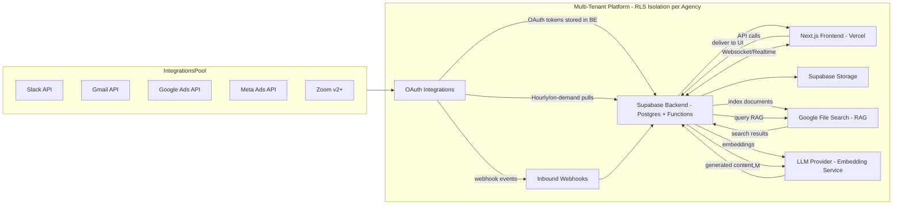

# Technical Architecture Diagram

> Synced from Drive: 2025-12-31
> Updated: 2025-12-31 (Multi-tenant architecture, updated tech stack versions)

## High-Level Diagram (Mermaid)

---

## Data Flow

1. **Frontend** (Next.js on Vercel) is the primary UI. It communicates over secure REST + realtime (Supabase Realtime) to the backend.

2. **Supabase** holds the canonical data (clients, tickets, ads metrics, workflows) and file storage.

3. **Integrations** are performed server-side via OAuth. Hourly cron jobs or on-demand endpoints ingest Slack/Gmail/Ads data into canonical tables; documents are stored in Supabase Storage and indexed to Google File Search for RAG.

4. **LLM/embedding service** is used for RAG + generation. Backend handles prompts, retrieval, and stores embeddings per tenant.

5. **All actions** that could change state require user confirmation. Automations are executed by backend worker (a serverless function) which logs runs and can be called via Webhook.

---

## Tech Stack Summary

| Layer | Technology |
|-------|------------|
| **Frontend** | Next.js 15 (App Router), React 19, TypeScript |
| **Styling** | Tailwind CSS, shadcn/ui (Linear design system) |
| **Backend** | Next.js API Routes (`/app/api/`) |
| **Database** | PostgreSQL via Supabase |
| **Auth** | Supabase Auth (JWT-based) |
| **Storage** | Supabase Storage (documents) |
| **Realtime** | Supabase Realtime (WebSocket) |
| **Vector Search** | Google File Search API (RAG) |
| **Embeddings** | OpenAI `text-embedding-3-small` |
| **LLM** | Anthropic Claude 3.5 Sonnet (primary) |
| **Secrets** | GCP KMS for token encryption |
| **Hosting** | Vercel |
| **CI/CD** | GitHub Actions |

---

*Synced from Drive — Living Document*
