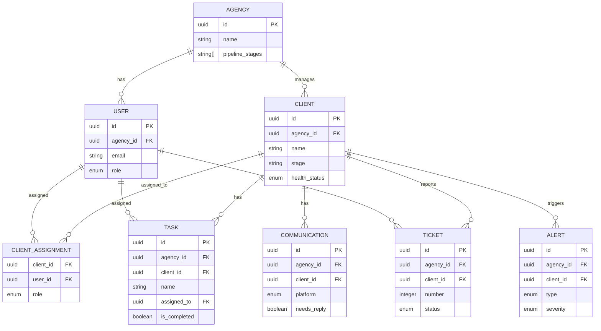

# AudienceOS Command Center - Data Model

> **Created:** 2025-12-31 (D-1 SpecKit)
> **Source:** 56 user stories + War Room multi-tenant patterns
> **Architecture:** Multi-tenant RLS with Supabase

---

## Multi-Tenant Architecture

### Isolation Strategy
- **Primary Key:** `agency_id` (UUID) in all tenant-scoped tables
- **JWT Claims:** `agency_id` included in Supabase Auth JWT
- **RLS Policies:** All queries automatically filtered by `auth.jwt() ->> 'agency_id'`
- **Pattern:** Based on War Room proven patterns

---

## Core Entities

### 1. AGENCY (Tenant Root)

| Field | Type | Required | Description |
|-------|------|----------|-------------|
| id | UUID | Yes | Primary key, tenant isolator |
| name | String(100) | Yes | Agency name |
| slug | String(50) | Yes | URL-safe identifier |
| logo_url | String(500) | No | Agency logo |
| domain | String(100) | No | Custom domain |
| timezone | String(50) | Yes | Default: UTC |
| business_hours | JSONB | No | Start/end hours |
| pipeline_stages | String[] | Yes | Default: [Onboarding, Installation, Audit, Live, Needs Support, Off-Boarding] |
| health_thresholds | JSONB | Yes | Days before Yellow/Red alerts |
| created_at | Timestamp | Yes | Record creation |
| updated_at | Timestamp | Yes | Last modification |

**RLS Policy:** Users can only access their own agency
```sql
CREATE POLICY agency_rls ON agency FOR ALL
USING (id = (auth.jwt() ->> 'agency_id')::uuid);
```

---

### 2. USER

| Field | Type | Required | Description |
|-------|------|----------|-------------|
| id | UUID | Yes | Primary key (Supabase Auth) |
| agency_id | UUID | Yes | FK to agency |
| email | String(100) | Yes | Unique per agency |
| first_name | String(50) | Yes | User first name |
| last_name | String(50) | Yes | User last name |
| role | Enum | Yes | admin, user |
| avatar_url | String(500) | No | Profile picture |
| is_active | Boolean | Yes | Default: true |
| last_active_at | Timestamp | No | Last login |
| preferences | JSONB | No | Notification settings |
| created_at | Timestamp | Yes | Record creation |
| updated_at | Timestamp | Yes | Last modification |

**RLS Policy:** Agency-scoped access only
```sql
CREATE POLICY user_rls ON "user" FOR ALL
USING (agency_id = (auth.jwt() ->> 'agency_id')::uuid);
```

---

### 3. CLIENT (Core Entity)

| Field | Type | Required | Description |
|-------|------|----------|-------------|
| id | UUID | Yes | Primary key |
| agency_id | UUID | Yes | FK to agency |
| name | String(100) | Yes | Client company name |
| contact_email | String(100) | No | Primary contact |
| contact_name | String(100) | No | Primary contact name |
| stage | String(50) | Yes | Current pipeline stage |
| health_status | Enum | Yes | green, yellow, red |
| days_in_stage | Integer | Yes | Auto-calculated |
| install_date | Date | No | When went live |
| total_spend | Decimal | No | Aggregated ad spend |
| lifetime_value | Decimal | No | Client LTV |
| notes | Text | No | Internal notes |
| tags | String[] | No | Custom tags |
| is_active | Boolean | Yes | Default: true |
| created_at | Timestamp | Yes | Record creation |
| updated_at | Timestamp | Yes | Last modification |

**Indexes:**
```sql
CREATE INDEX idx_client_agency_stage ON client(agency_id, stage);
CREATE INDEX idx_client_health ON client(agency_id, health_status);
```

---

### 4. CLIENT_ASSIGNMENT (User-Client Mapping)

| Field | Type | Required | Description |
|-------|------|----------|-------------|
| id | UUID | Yes | Primary key |
| agency_id | UUID | Yes | FK to agency |
| client_id | UUID | Yes | FK to client |
| user_id | UUID | Yes | FK to user |
| role | Enum | Yes | owner, collaborator |
| created_at | Timestamp | Yes | Assignment date |

**Unique Constraint:** (client_id, user_id, role)

---

### 5. STAGE_EVENT (Pipeline History)

| Field | Type | Required | Description |
|-------|------|----------|-------------|
| id | UUID | Yes | Primary key |
| agency_id | UUID | Yes | FK to agency |
| client_id | UUID | Yes | FK to client |
| from_stage | String(50) | No | Previous stage (null for initial) |
| to_stage | String(50) | Yes | New stage |
| moved_by | UUID | Yes | FK to user |
| moved_at | Timestamp | Yes | When moved |
| notes | Text | No | Reason for move |

---

### 6. TASK (Client Checklist Items)

| Field | Type | Required | Description |
|-------|------|----------|-------------|
| id | UUID | Yes | Primary key |
| agency_id | UUID | Yes | FK to agency |
| client_id | UUID | Yes | FK to client |
| name | String(200) | Yes | Task title |
| description | Text | No | Task details |
| stage | String(50) | No | Associated pipeline stage |
| assigned_to | UUID | No | FK to user |
| due_date | Date | No | Deadline |
| is_completed | Boolean | Yes | Default: false |
| completed_at | Timestamp | No | Completion time |
| completed_by | UUID | No | FK to user |
| sort_order | Integer | Yes | Display order |
| created_at | Timestamp | Yes | Task creation |
| updated_at | Timestamp | Yes | Last modification |

**RLS Policy:** Agency-scoped access
```sql
CREATE POLICY task_rls ON task FOR ALL
USING (agency_id = (auth.jwt() ->> 'agency_id')::uuid);
```

**Indexes:**
```sql
CREATE INDEX idx_task_client_stage ON task(agency_id, client_id, stage);
CREATE INDEX idx_task_assignee ON task(agency_id, assigned_to) WHERE is_completed = false;
```

---

## Communications

### 7. INTEGRATION

| Field | Type | Required | Description |
|-------|------|----------|-------------|
| id | UUID | Yes | Primary key |
| agency_id | UUID | Yes | FK to agency |
| provider | Enum | Yes | slack, gmail, google_ads, meta_ads |
| is_connected | Boolean | Yes | Connection status |
| access_token | Text | No | Encrypted OAuth token |
| refresh_token | Text | No | Encrypted refresh token |
| token_expires_at | Timestamp | No | Token expiry |
| last_sync_at | Timestamp | No | Last successful sync |
| config | JSONB | No | Provider-specific settings |
| created_at | Timestamp | Yes | Integration setup |
| updated_at | Timestamp | Yes | Last token refresh |

**Encryption:** Tokens stored via Supabase Vault

---

### 8. COMMUNICATION

| Field | Type | Required | Description |
|-------|------|----------|-------------|
| id | UUID | Yes | Primary key |
| agency_id | UUID | Yes | FK to agency |
| client_id | UUID | Yes | FK to client |
| platform | Enum | Yes | slack, gmail |
| thread_id | String(100) | No | External thread identifier |
| message_id | String(100) | Yes | External message identifier |
| sender_email | String(100) | No | Sender email |
| sender_name | String(100) | No | Sender display name |
| subject | String(200) | No | Email subject |
| content | Text | Yes | Message body |
| is_inbound | Boolean | Yes | From client vs to client |
| needs_reply | Boolean | Yes | Requires response |
| replied_at | Timestamp | No | When replied |
| replied_by | UUID | No | FK to user who replied |
| received_at | Timestamp | Yes | When received |
| created_at | Timestamp | Yes | Record creation |

**Indexes:**
```sql
CREATE INDEX idx_comm_client_platform ON communication(agency_id, client_id, platform);
CREATE INDEX idx_comm_needs_reply ON communication(agency_id, needs_reply) WHERE needs_reply = true;
```

---

## AI Intelligence

### 9. ALERT

| Field | Type | Required | Description |
|-------|------|----------|-------------|
| id | UUID | Yes | Primary key |
| agency_id | UUID | Yes | FK to agency |
| client_id | UUID | No | FK to client (optional) |
| type | Enum | Yes | risk_detected, kpi_drop, inactivity, disconnect |
| severity | Enum | Yes | low, medium, high, critical |
| title | String(200) | Yes | Alert headline |
| description | Text | Yes | Detailed explanation |
| suggested_action | Text | No | AI recommendation |
| confidence | Decimal(3,2) | Yes | 0.00-1.00 confidence score |
| status | Enum | Yes | active, snoozed, dismissed, resolved |
| snoozed_until | Timestamp | No | When to re-surface |
| resolved_by | UUID | No | FK to user |
| resolved_at | Timestamp | No | Resolution time |
| metadata | JSONB | No | Context data |
| created_at | Timestamp | Yes | Alert generation |
| updated_at | Timestamp | Yes | Status changes |

---

### 10. DOCUMENT

| Field | Type | Required | Description |
|-------|------|----------|-------------|
| id | UUID | Yes | Primary key |
| agency_id | UUID | Yes | FK to agency |
| title | String(200) | Yes | Document title |
| file_name | String(200) | Yes | Original filename |
| file_size | Integer | Yes | Bytes |
| mime_type | String(100) | Yes | File type |
| storage_path | String(500) | Yes | Supabase Storage path |
| category | Enum | Yes | installation, tech, support, process, client_specific |
| client_id | UUID | No | FK to client (if client-specific) |
| page_count | Integer | No | For PDFs |
| word_count | Integer | No | Estimated words |
| index_status | Enum | Yes | pending, indexing, indexed, failed |
| gemini_file_id | String(200) | No | Gemini File Search ID |
| uploaded_by | UUID | Yes | FK to user |
| is_active | Boolean | Yes | Default: true |
| created_at | Timestamp | Yes | Upload time |
| updated_at | Timestamp | Yes | Last modification |

**Gemini Integration:**
- Store naming: `audienceos-{agency_id}`
- Multi-tenant isolation via agency-scoped stores

---

### 11. CHAT_SESSION

| Field | Type | Required | Description |
|-------|------|----------|-------------|
| id | UUID | Yes | Primary key |
| agency_id | UUID | Yes | FK to agency |
| user_id | UUID | Yes | FK to user |
| title | String(200) | No | Session name |
| context | JSONB | No | Session metadata |
| is_active | Boolean | Yes | Default: true |
| last_message_at | Timestamp | No | Recent activity |
| created_at | Timestamp | Yes | Session start |

---

### 12. CHAT_MESSAGE

| Field | Type | Required | Description |
|-------|------|----------|-------------|
| id | UUID | Yes | Primary key |
| session_id | UUID | Yes | FK to chat_session |
| agency_id | UUID | Yes | FK to agency |
| role | Enum | Yes | user, assistant |
| content | Text | Yes | Message text |
| route_used | Enum | No | rag, web, memory, casual, dashboard |
| citations | JSONB | No | Source references |
| tokens_used | Integer | No | API usage tracking |
| created_at | Timestamp | Yes | Message time |

---

## Support System

### 13. TICKET

| Field | Type | Required | Description |
|-------|------|----------|-------------|
| id | UUID | Yes | Primary key |
| agency_id | UUID | Yes | FK to agency |
| client_id | UUID | Yes | FK to client |
| number | Integer | Yes | Auto-incrementing ticket # |
| title | String(200) | Yes | Issue summary |
| description | Text | Yes | Detailed description |
| category | Enum | Yes | technical, billing, campaign, general, escalation |
| priority | Enum | Yes | low, medium, high, critical |
| status | Enum | Yes | new, in_progress, waiting_client, resolved |
| assignee_id | UUID | No | FK to user |
| resolution_notes | Text | No | Final resolution |
| time_spent_minutes | Integer | No | Optional time tracking |
| due_date | Date | No | Optional deadline |
| created_by | UUID | Yes | FK to user |
| resolved_by | UUID | No | FK to user |
| resolved_at | Timestamp | No | Resolution time |
| created_at | Timestamp | Yes | Ticket creation |
| updated_at | Timestamp | Yes | Last modification |

**Auto-increment:** Per-agency ticket numbering

---

### 14. TICKET_NOTE

| Field | Type | Required | Description |
|-------|------|----------|-------------|
| id | UUID | Yes | Primary key |
| agency_id | UUID | Yes | FK to agency |
| ticket_id | UUID | Yes | FK to ticket |
| content | Text | Yes | Note content |
| is_internal | Boolean | Yes | Internal vs client-facing |
| added_by | UUID | Yes | FK to user |
| created_at | Timestamp | Yes | Note creation |

---

## Automation System

### 15. WORKFLOW

| Field | Type | Required | Description |
|-------|------|----------|-------------|
| id | UUID | Yes | Primary key |
| agency_id | UUID | Yes | FK to agency |
| name | String(200) | Yes | Workflow name |
| description | Text | No | Purpose |
| triggers | JSONB | Yes | Array of trigger configs |
| actions | JSONB | Yes | Array of action configs |
| is_active | Boolean | Yes | Default: true |
| created_by | UUID | Yes | FK to user |
| last_run_at | Timestamp | No | Recent execution |
| run_count | Integer | Yes | Default: 0 |
| success_count | Integer | Yes | Default: 0 |
| created_at | Timestamp | Yes | Workflow creation |
| updated_at | Timestamp | Yes | Last modification |

---

### 16. WORKFLOW_RUN

| Field | Type | Required | Description |
|-------|------|----------|-------------|
| id | UUID | Yes | Primary key |
| agency_id | UUID | Yes | FK to agency |
| workflow_id | UUID | Yes | FK to workflow |
| trigger_data | JSONB | Yes | What triggered the run |
| status | Enum | Yes | running, completed, failed |
| executed_actions | JSONB | No | Actions performed |
| error_message | Text | No | If failed |
| started_at | Timestamp | Yes | Execution start |
| completed_at | Timestamp | No | Execution end |

---

## Settings & Preferences

### 17. USER_PREFERENCE

| Field | Type | Required | Description |
|-------|------|----------|-------------|
| id | UUID | Yes | Primary key |
| user_id | UUID | Yes | FK to user |
| agency_id | UUID | Yes | FK to agency |
| category | Enum | Yes | notifications, ai, display |
| key | String(100) | Yes | Setting name |
| value | JSONB | Yes | Setting value |
| created_at | Timestamp | Yes | Preference set |
| updated_at | Timestamp | Yes | Last changed |

**Unique Constraint:** (user_id, category, key)

---

## Performance & Analytics

### 18. KPI_SNAPSHOT

| Field | Type | Required | Description |
|-------|------|----------|-------------|
| id | UUID | Yes | Primary key |
| agency_id | UUID | Yes | FK to agency |
| metric_name | String(100) | Yes | KPI identifier |
| value | Decimal(12,2) | Yes | Metric value |
| previous_value | Decimal(12,2) | No | For trend calculation |
| metadata | JSONB | No | Calculation details |
| snapshot_date | Date | Yes | When calculated |
| created_at | Timestamp | Yes | Record creation |

**Indexes:**
```sql
CREATE INDEX idx_kpi_agency_metric ON kpi_snapshot(agency_id, metric_name, snapshot_date DESC);
```

---

### 19. AD_PERFORMANCE

| Field | Type | Required | Description |
|-------|------|----------|-------------|
| id | UUID | Yes | Primary key |
| agency_id | UUID | Yes | FK to agency |
| client_id | UUID | Yes | FK to client |
| platform | Enum | Yes | google_ads, meta_ads |
| account_id | String(100) | Yes | External account ID |
| campaign_id | String(100) | No | External campaign ID |
| date | Date | Yes | Performance date |
| spend | Decimal(10,2) | Yes | Daily spend |
| impressions | Integer | Yes | Ad impressions |
| clicks | Integer | Yes | Click count |
| conversions | Decimal(8,2) | Yes | Conversion count |
| revenue | Decimal(10,2) | No | Attributed revenue |
| created_at | Timestamp | Yes | Data sync time |

**Indexes:**
```sql
CREATE INDEX idx_ad_perf_client_date ON ad_performance(agency_id, client_id, date DESC);
```

---

## Relationships



---

## Database Choice

| Decision | Technology | Rationale |
|----------|------------|-----------|
| **Database** | Supabase (PostgreSQL) | RLS native, real-time updates, managed |
| **ORM** | Drizzle | Type-safe, lightweight, RLS compatible |
| **Migrations** | Drizzle Migrate | Version control, team sync |
| **Real-time** | Supabase Realtime | Built-in WebSocket subscriptions |

---

## RLS Security Model

### Global Policies
All tables include `agency_id` and enforce:
```sql
CREATE POLICY rls_agency_isolation ON [table] FOR ALL
USING (agency_id = (auth.jwt() ->> 'agency_id')::uuid);
```

### Admin Overrides
```sql
-- Service role can bypass RLS for system operations
ALTER TABLE [table] ENABLE ROW LEVEL SECURITY;
ALTER TABLE [table] FORCE ROW LEVEL SECURITY;
```

### Public Tables (No RLS)
None - all tables are tenant-scoped for security.

---

## Storage Architecture

### Supabase Storage Buckets
- **documents**: Document uploads (PDF, DOCX)
- **media**: Images, logos, avatars
- **exports**: Generated reports, CSV exports

### Storage Policies
```sql
-- Documents: agency-scoped access
CREATE POLICY "Agency document access" ON storage.objects FOR ALL
USING (bucket_id = 'documents' AND
       (storage.foldername(name))[1] = (auth.jwt() ->> 'agency_id'));
```

---

## Indexes Strategy

### Performance Indexes
```sql
-- Multi-tenant queries
CREATE INDEX idx_table_agency ON [table](agency_id);

-- Dashboard queries
CREATE INDEX idx_client_health ON client(agency_id, health_status);
CREATE INDEX idx_alert_active ON alert(agency_id, status) WHERE status = 'active';

-- Communications
CREATE INDEX idx_comm_needs_reply ON communication(agency_id, needs_reply, received_at DESC);

-- Performance
CREATE INDEX idx_ad_perf_date ON ad_performance(agency_id, client_id, date DESC);
```

---

## Migration Strategy

### Phase 1: Core Tables
1. AGENCY, USER (auth setup)
2. CLIENT, CLIENT_ASSIGNMENT (pipeline)
3. STAGE_EVENT (history tracking)

### Phase 2: Integrations
1. INTEGRATION (OAuth setup)
2. COMMUNICATION (Slack/Gmail sync)

### Phase 3: Intelligence
1. DOCUMENT, CHAT_SESSION, CHAT_MESSAGE (AI features)
2. ALERT (risk detection)

### Phase 4: Support & Automation
1. TICKET, TICKET_NOTE (support system)
2. WORKFLOW, WORKFLOW_RUN (automation)

### Phase 5: Analytics
1. KPI_SNAPSHOT, AD_PERFORMANCE (dashboard metrics)
2. USER_PREFERENCE (settings)

---

## Changelog

| Date | Change |
|------|--------|
| 2025-01-01 | Added TASK entity (missing from original spec, required by API-CONTRACTS). Total entities: 18 → 19. |
| 2025-12-31 | Created comprehensive data model from 56 user stories |

---

*Living Document - Located at docs/04-technical/DATA-MODEL.md*