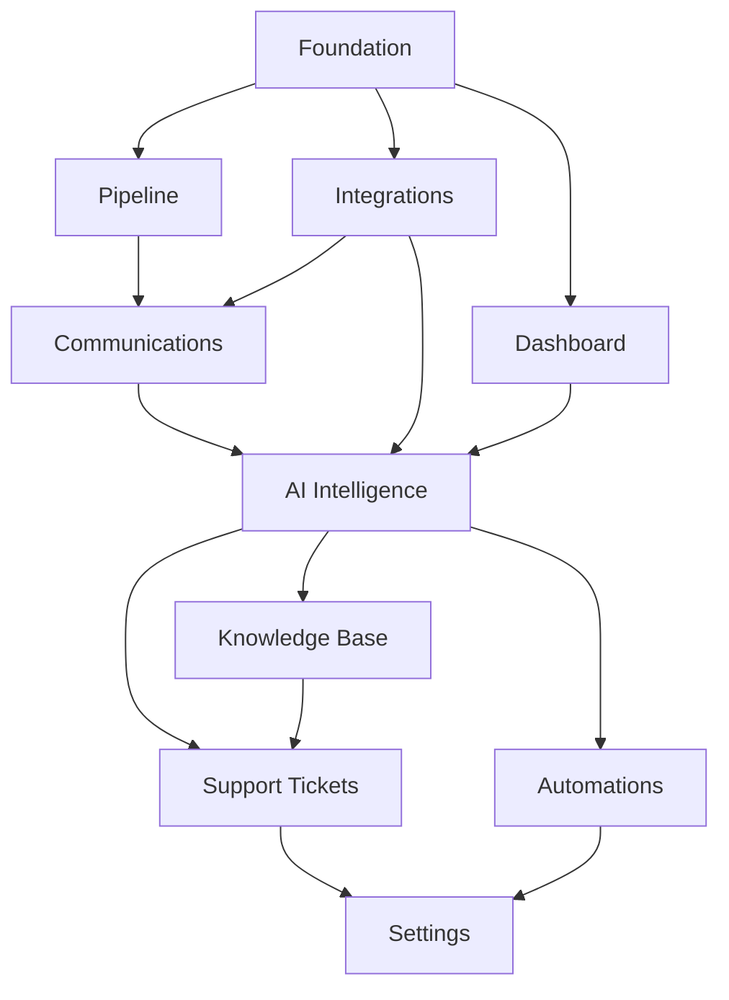

# AudienceOS Command Center - Implementation Roadmap

> **Total Tasks:** 206
> **Created:** 2025-12-31
> **Last Updated:** 2026-01-02
> **Status:** In Progress - Foundation Phase

---

## Current State (2026-01-03)

| Layer | Status | Notes |
|-------|--------|-------|
| **Frontend UI** | ✅ 90% Complete | 80+ components, 11 views, UI polish pass done |
| **API Routes** | ✅ Complete | 24 endpoints built |
| **Zustand Stores** | ✅ Complete | 6 stores |
| **Demo Mode** | ✅ Working | Mock data fallback when unauthenticated |
| **Database Schema** | ✅ APPLIED | All 19 tables with RLS, seed data loaded |
| **Auth** | ✅ Working | Supabase Auth + user table linked |
| **Third-party APIs** | ❌ Not Connected | OAuth creds empty |

**LATEST (2026-01-03):** UI polish pass completed - cursor-pointer on all clickable elements, interactive intake checklist, IntegrationCard button anchoring, Activity section scrollable. Build verified. See RUNBOOK.md for verification commands.

**DEVELOPMENT:** App works in demo mode with mock data. All views functional.
**PRODUCTION:** Supabase has legacy War Room schema (Nov 2025). The `001_initial_schema.sql` migration was never applied.

---

## Overview

This roadmap consolidates all implementation tasks from feature specs into a prioritized execution plan.

**Execution order was inverted:** UI was built before database. Foundation tasks are now the priority.

---

## Phase 1: Foundation (Weeks 1-2)

### 1.1 Database & Auth Setup
| ID | Task | Feature | Est |
|----|------|---------|-----|
| FOUND-001 | Create TICKET_STATUS_EVENT table migration | support-tickets | 30m |
| FOUND-002 | Add RLS policies for ticket tables | support-tickets | 30m |
| FOUND-003 | Create USER_PREFERENCES table migration | settings | 30m |
| FOUND-004 | Add new fields to AGENCY table | settings | 30m |
| FOUND-005 | Create DOCUMENT and DOCUMENT_USAGE tables | knowledge-base | 30m |
| FOUND-006 | Configure Supabase Storage bucket with RLS | knowledge-base | 30m |
| FOUND-007 | Create workflow tables migration | automations | 30m |
| FOUND-008 | Set up vector embeddings storage (pgvector) | ai-intelligence | 45m |
| FOUND-009 | Create COMMUNICATION table indexes for performance | comms-hub | 30m |

### 1.2 API Integration Setup
| ID | Task | Feature | Est |
|----|------|---------|-----|
| FOUND-010 | Set up Claude API integration with rate limiting | ai-intelligence | 45m |
| FOUND-011 | Configure Gemini File Search API and indexing pipeline | ai-intelligence | 60m |
| FOUND-012 | Set up Gemini File Search integration | knowledge-base | 45m |
| FOUND-013 | Set up OAuth app registrations (Slack, Google, Meta) | integrations | 60m |
| FOUND-014 | Configure Supabase Vault for token encryption | integrations | 30m |

---

## Phase 2: Core Pipeline (Weeks 3-4)

### 2.1 Pipeline Kanban
| ID | Task | Feature | Est |
|----|------|---------|-----|
| PIPE-001 | Install @dnd-kit/core, @dnd-kit/sortable, @dnd-kit/utilities | pipeline | 15m |
| PIPE-002 | Create KanbanBoard component shell with 6 columns | pipeline | 45m |
| PIPE-003 | Set up Zustand store for pipeline state | pipeline | 30m |
| PIPE-004 | Implement ClientCard component with health indicators | pipeline | 45m |
| PIPE-005 | Add dnd-kit drag-drop functionality | pipeline | 60m |
| PIPE-006 | Connect GET /v1/clients API with filtering | pipeline | 30m |
| PIPE-007 | Implement POST /v1/clients/{id}/move stage updates | pipeline | 30m |
| PIPE-008 | Add optimistic UI updates with error rollback | pipeline | 45m |

### 2.2 Client Detail Drawer
| ID | Task | Feature | Est |
|----|------|---------|-----|
| PIPE-009 | Create ClientDrawer slide-out component | pipeline | 45m |
| PIPE-010 | Implement drawer tabs (Overview, Comms, Tasks, Performance, Media) | pipeline | 60m |
| PIPE-011 | Add deep linking (URL updates on drawer open) | pipeline | 30m |
| PIPE-012 | Connect stage history API for timeline | pipeline | 30m |

### 2.3 Pipeline Filtering & Polish
| ID | Task | Feature | Est |
|----|------|---------|-----|
| PIPE-013 | Add FilterChips component above board | pipeline | 30m |
| PIPE-014 | Implement "My clients" filter using CLIENT_ASSIGNMENT | pipeline | 30m |
| PIPE-015 | Add "At risk" and "Blocked" filters | pipeline | 30m |
| PIPE-016 | Persist filter state in URL query params | pipeline | 30m |
| PIPE-017 | Add toast notifications for stage changes | pipeline | 20m |
| PIPE-018 | Implement column pagination (max 10 cards) | pipeline | 45m |
| PIPE-019 | Add loading skeletons and error states | pipeline | 30m |
| PIPE-020 | Mobile responsiveness (stack columns vertically) | pipeline | 45m |

---

## Phase 3: Dashboard (Weeks 5-6)

### 3.1 Dashboard KPIs
| ID | Task | Feature | Est |
|----|------|---------|-----|
| DASH-001 | Create dashboard KPI calculation functions | dashboard | 60m |
| DASH-002 | Set up hourly background job for metric refresh | dashboard | 45m |
| DASH-003 | Configure Supabase Realtime for at-risk clients | dashboard | 30m |
| DASH-004 | Create dashboard API endpoints | dashboard | 45m |
| DASH-005 | Build KPICard component with trend indicators | dashboard | 45m |
| DASH-006 | Implement Active Onboardings calculation | dashboard | 30m |
| DASH-007 | Implement At-Risk Clients with real-time updates | dashboard | 45m |
| DASH-008 | Build Support Hours tracking (weekly aggregation) | dashboard | 30m |
| DASH-009 | Calculate Average Install Time (30-day rolling) | dashboard | 30m |
| DASH-010 | Implement Clients Needing Attention logic | dashboard | 45m |

### 3.2 Dashboard Charts
| ID | Task | Feature | Est |
|----|------|---------|-----|
| DASH-011 | Build TimeSeriesChart component (Recharts) | dashboard | 60m |
| DASH-012 | Implement New vs Completed Installs data pipeline | dashboard | 45m |
| DASH-013 | Add chart hover tooltips and responsive design | dashboard | 30m |
| DASH-014 | Build time period toggles (7/30/90 days) | dashboard | 30m |

### 3.3 Dashboard Interactions
| ID | Task | Feature | Est |
|----|------|---------|-----|
| DASH-015 | Implement drill-down navigation with URL state | dashboard | 45m |
| DASH-016 | Build manual refresh with loading indicators | dashboard | 20m |
| DASH-017 | Add responsive grid layout for mobile | dashboard | 45m |
| DASH-018 | Implement auto-refresh countdown display | dashboard | 20m |
| DASH-019 | Add KPI caching layer (Redis or memory) | dashboard | 45m |
| DASH-020 | Optimize database queries with proper indexes | dashboard | 30m |
| DASH-021 | Implement error handling and fallback states | dashboard | 30m |
| DASH-022 | Add CSV export for chart data | dashboard | 30m |

---

## Phase 4: Communications Hub (Weeks 7-8)

### 4.1 Integration Setup
| ID | Task | Feature | Est |
|----|------|---------|-----|
| COMM-001 | Set up Slack OAuth integration and Events API subscription | comms-hub | 60m |
| COMM-002 | Configure Gmail OAuth and Pub/Sub push notifications | comms-hub | 60m |
| COMM-003 | Set up webhook signature verification | comms-hub | 30m |

### 4.2 Message Sync
| ID | Task | Feature | Est |
|----|------|---------|-----|
| COMM-004 | Implement Slack webhook handler with message deduplication | comms-hub | 60m |
| COMM-005 | Implement Gmail webhook handler with thread detection | comms-hub | 60m |
| COMM-006 | Build message ingestion pipeline with client linking | comms-hub | 60m |
| COMM-007 | Add background job to compute "needs_reply" flags | comms-hub | 45m |

### 4.3 Timeline UI
| ID | Task | Feature | Est |
|----|------|---------|-----|
| COMM-008 | Create CommunicationsTimeline component with virtualization | comms-hub | 60m |
| COMM-009 | Implement MessageBubble with platform icons and threading | comms-hub | 45m |
| COMM-010 | Add thread collapsing/expansion functionality | comms-hub | 30m |
| COMM-011 | Build unread indicators and read status tracking | comms-hub | 45m |
| COMM-012 | Add SourceFilter component (Slack/Gmail/All) | comms-hub | 30m |
| COMM-013 | Implement "needs reply" filter toggle | comms-hub | 20m |
| COMM-014 | Add search functionality within timeline | comms-hub | 45m |
| COMM-015 | Persist filter state in URL query params | comms-hub | 20m |

### 4.4 Replies
| ID | Task | Feature | Est |
|----|------|---------|-----|
| COMM-016 | Integrate AI draft generation with conversation context | comms-hub | 60m |
| COMM-017 | Build ReplyComposer with AI draft button | comms-hub | 45m |
| COMM-018 | Implement send via Slack API and Gmail API | comms-hub | 60m |
| COMM-019 | Add optimistic updates with error rollback | comms-hub | 30m |
| COMM-020 | Add loading states and skeleton placeholders | comms-hub | 30m |
| COMM-021 | Implement real-time updates via Supabase Realtime | comms-hub | 45m |
| COMM-022 | Mobile responsive design for timeline | comms-hub | 45m |
| COMM-023 | Deep linking to specific messages | comms-hub | 30m |

---

## Phase 5: Integrations Management (Weeks 9-10)

### 5.1 OAuth Flows
| ID | Task | Feature | Est |
|----|------|---------|-----|
| INTG-001 | Create integration CRUD API endpoints | integrations | 30m |
| INTG-002 | Set up background job for token refresh monitoring | integrations | 45m |
| INTG-003 | Implement Slack OAuth 2.0 flow with workspace selection | integrations | 60m |
| INTG-004 | Build Gmail OAuth with scope selection (read, send) | integrations | 60m |
| INTG-005 | Create Google Ads OAuth with account permissions | integrations | 60m |
| INTG-006 | Implement Meta Ads OAuth with Business Manager access | integrations | 60m |
| INTG-007 | Add OAuth callback handling and token storage | integrations | 45m |

### 5.2 Integrations UI
| ID | Task | Feature | Est |
|----|------|---------|-----|
| INTG-008 | Build IntegrationsGrid with responsive layout | integrations | 45m |
| INTG-009 | Create IntegrationCard with status indicators | integrations | 30m |
| INTG-010 | Implement OAuthButton with popup/redirect handling | integrations | 45m |
| INTG-011 | Build SettingsModal with integration-specific forms | integrations | 60m |
| INTG-012 | Add TestConnection with API validation | integrations | 45m |

### 5.3 Token Management
| ID | Task | Feature | Est |
|----|------|---------|-----|
| INTG-013 | Implement automatic token refresh background job | integrations | 45m |
| INTG-014 | Build manual token refresh with user feedback | integrations | 30m |
| INTG-015 | Add token expiry monitoring and alerts | integrations | 45m |
| INTG-016 | Create audit logging for all token operations | integrations | 30m |

### 5.4 MCP Integration
| ID | Task | Feature | Est |
|----|------|---------|-----|
| INTG-017 | Implement chi-gateway MCP integration for Google Ads | integrations | 60m |
| INTG-018 | Add chi-gateway MCP for Meta Ads | integrations | 60m |
| INTG-019 | Build MCP vs OAuth toggle for ads platforms | integrations | 30m |
| INTG-020 | Plan OAuth migration path for v2 | integrations | 30m |

### 5.5 Error Handling
| ID | Task | Feature | Est |
|----|------|---------|-----|
| INTG-021 | Add comprehensive error handling for each provider | integrations | 45m |
| INTG-022 | Implement retry logic with exponential backoff | integrations | 30m |
| INTG-023 | Build user-friendly error messages and resolution steps | integrations | 30m |
| INTG-024 | Add integration health monitoring and alerting | integrations | 45m |

---

## Phase 6: AI Intelligence Layer (Weeks 11-14)

### 6.1 Risk Detection Engine
| ID | Task | Feature | Est |
|----|------|---------|-----|
| AI-001 | Create ALERT table triggers for real-time updates | ai-intelligence | 30m |
| AI-002 | Implement background job for client health monitoring | ai-intelligence | 60m |
| AI-003 | Build configurable risk rules engine | ai-intelligence | 90m |
| AI-004 | Create alert generation with confidence scoring | ai-intelligence | 60m |
| AI-005 | Add suggested actions generation per alert type | ai-intelligence | 60m |

### 6.2 Intelligence Center UI
| ID | Task | Feature | Est |
|----|------|---------|-----|
| AI-006 | Create IntelligenceCenter dashboard layout | ai-intelligence | 45m |
| AI-007 | Build AlertCard components with severity styling | ai-intelligence | 45m |
| AI-008 | Implement alert filtering and grouping | ai-intelligence | 30m |
| AI-009 | Add AlertDrawer with action approval workflow | ai-intelligence | 60m |

### 6.3 Chi Intelligent Chat - Core
| ID | Task | Feature | Est |
|----|------|---------|-----|
| AI-010 | Extract @chi/intelligent-chat package from War Room | ai-intelligence | 120m |
| AI-011 | Implement SmartRouter with 5 route types | ai-intelligence | 90m |
| AI-012 | Build ChatService with streaming SSE responses | ai-intelligence | 60m |
| AI-013 | Create ChatContext manager for session state | ai-intelligence | 45m |
| AI-014 | Integrate progressive reveal and citation display | ai-intelligence | 60m |
| AI-015 | Connect RAG pipeline with Gemini File Search | ai-intelligence | 60m |
| AI-016 | Add floating widget with context persistence | ai-intelligence | 45m |

### 6.4 Self-Awareness System
| ID | Task | Feature | Est |
|----|------|---------|-----|
| AI-017 | Create AppKnowledgeService with metrics/features catalog | ai-intelligence | 60m |
| AI-018 | Build system-identity.md equivalent for AudienceOS | ai-intelligence | 45m |
| AI-019 | Implement capability introspection endpoints | ai-intelligence | 30m |
| AI-020 | Add "What can you do?" query handling | ai-intelligence | 30m |

### 6.5 Cross-Session Memory
| ID | Task | Feature | Est |
|----|------|---------|-----|
| AI-021 | Integrate Mem0 for memory storage | ai-intelligence | 60m |
| AI-022 | Build memory injection into system prompts | ai-intelligence | 45m |
| AI-023 | Implement "Do you remember..." query detection | ai-intelligence | 30m |
| AI-024 | Add tenant + user scoping for memory isolation | ai-intelligence | 30m |

### 6.6 Citation System
| ID | Task | Feature | Est |
|----|------|---------|-----|
| AI-025 | Build citation extraction from RAG responses | ai-intelligence | 45m |
| AI-026 | Implement fuzzy matching with 5 fallback strategies | ai-intelligence | 60m |
| AI-027 | Create DocumentViewerModal for citation clicks | ai-intelligence | 45m |
| AI-028 | Add citation highlighting in responses | ai-intelligence | 30m |

### 6.7 Response Calibration
| ID | Task | Feature | Est |
|----|------|---------|-----|
| AI-029 | Build query type detection (simple/howto/analysis/report) | ai-intelligence | 45m |
| AI-030 | Implement prompt-based length control | ai-intelligence | 30m |
| AI-031 | Add follow-up question generation | ai-intelligence | 45m |
| AI-032 | Create response streaming with abort handling | ai-intelligence | 45m |

### 6.8 Draft Generation
| ID | Task | Feature | Est |
|----|------|---------|-----|
| AI-033 | Implement context-aware draft generation | ai-intelligence | 60m |
| AI-034 | Add multiple draft variations (tone, urgency) | ai-intelligence | 45m |
| AI-035 | Build draft composer with edit capabilities | ai-intelligence | 45m |
| AI-036 | Connect to communications and alerts | ai-intelligence | 30m |

### 6.9 Performance & Monitoring
| ID | Task | Feature | Est |
|----|------|---------|-----|
| AI-037 | Add AI usage analytics and token tracking | ai-intelligence | 45m |
| AI-038 | Implement performance metrics for risk detection | ai-intelligence | 30m |
| AI-039 | Build false positive feedback loop | ai-intelligence | 45m |
| AI-040 | Add real-time alerts via Supabase Realtime | ai-intelligence | 30m |

---

## Phase 7: Knowledge Base (Weeks 15-16)

### 7.1 Upload Flow
| ID | Task | Feature | Est |
|----|------|---------|-----|
| KB-001 | Build DocumentUploadModal with drag-drop | knowledge-base | 45m |
| KB-002 | Implement file validation (type, size) | knowledge-base | 30m |
| KB-003 | Create upload-to-storage API | knowledge-base | 30m |
| KB-004 | Extract metadata (page count, word count) | knowledge-base | 30m |

### 7.2 Indexing
| ID | Task | Feature | Est |
|----|------|---------|-----|
| KB-005 | Build Gemini File Search indexing pipeline | knowledge-base | 60m |
| KB-006 | Implement document chunking for large files | knowledge-base | 45m |
| KB-007 | Create index status tracking and retry | knowledge-base | 30m |
| KB-008 | Add re-index functionality | knowledge-base | 30m |

### 7.3 Browse & Search
| ID | Task | Feature | Est |
|----|------|---------|-----|
| KB-009 | Build KnowledgeBasePage with CategorySidebar | knowledge-base | 60m |
| KB-010 | Create DocumentGrid with cards | knowledge-base | 45m |
| KB-011 | Implement full-text search endpoint | knowledge-base | 45m |
| KB-012 | Build DocumentViewerModal for previews | knowledge-base | 45m |

### 7.4 Integration
| ID | Task | Feature | Est |
|----|------|---------|-----|
| KB-013 | Connect to Chi Intelligent Chat for RAG queries | knowledge-base | 45m |

---

## Phase 8: Support Tickets (Weeks 17-18)

### 8.1 Ticket API
| ID | Task | Feature | Est |
|----|------|---------|-----|
| TKT-001 | Create ticket API routes | support-tickets | 45m |

### 8.2 Ticket Kanban UI
| ID | Task | Feature | Est |
|----|------|---------|-----|
| TKT-002 | Build TicketKanban with dnd-kit | support-tickets | 60m |
| TKT-003 | Create TicketCard component | support-tickets | 30m |
| TKT-004 | Implement drag-drop status changes | support-tickets | 45m |
| TKT-005 | Add filtering and sorting controls | support-tickets | 30m |

### 8.3 Ticket Management
| ID | Task | Feature | Est |
|----|------|---------|-----|
| TKT-006 | Build TicketDrawer with tabs (Details, Notes, History) | support-tickets | 60m |
| TKT-007 | Create TicketCreateModal | support-tickets | 30m |
| TKT-008 | Implement note system with timestamps | support-tickets | 30m |
| TKT-009 | Build TicketResolutionModal with validation | support-tickets | 30m |

### 8.4 AI Integration
| ID | Task | Feature | Est |
|----|------|---------|-----|
| TKT-010 | Add "Suggest Solution" endpoint | support-tickets | 45m |
| TKT-011 | Build AISuggestionPanel component | support-tickets | 45m |
| TKT-012 | Implement "Draft Response" generation | support-tickets | 30m |
| TKT-013 | Connect to Knowledge Base for similar issues | support-tickets | 30m |

### 8.5 Metrics & Email
| ID | Task | Feature | Est |
|----|------|---------|-----|
| TKT-014 | Create support metrics calculations | support-tickets | 30m |
| TKT-015 | Build TicketMetrics dashboard | support-tickets | 30m |
| TKT-016 | Implement client summary email on resolution | support-tickets | 45m |

---

## Phase 9: Automations (Weeks 19-20)

### 9.1 Execution Engine
| ID | Task | Feature | Est |
|----|------|---------|-----|
| AUTO-001 | Build workflow execution engine (background job) | automations | 90m |
| AUTO-002 | Set up scheduled trigger cron | automations | 45m |

### 9.2 Builder UI
| ID | Task | Feature | Est |
|----|------|---------|-----|
| AUTO-003 | Build AutomationsPage with list | automations | 45m |
| AUTO-004 | Create AutomationBuilder form | automations | 60m |
| AUTO-005 | Build TriggerSelector with config forms | automations | 60m |
| AUTO-006 | Create ActionChain with add/remove/reorder | automations | 60m |
| AUTO-007 | Implement delay and condition configuration | automations | 45m |

### 9.3 Triggers
| ID | Task | Feature | Est |
|----|------|---------|-----|
| AUTO-008 | Implement stage_change trigger listener | automations | 45m |
| AUTO-009 | Implement inactivity trigger (daily check) | automations | 45m |
| AUTO-010 | Implement kpi_threshold trigger | automations | 45m |
| AUTO-011 | Implement scheduled trigger (cron) | automations | 45m |

### 9.4 Actions
| ID | Task | Feature | Est |
|----|------|---------|-----|
| AUTO-012 | Implement create_task action | automations | 30m |
| AUTO-013 | Implement send_notification action | automations | 30m |
| AUTO-014 | Implement draft_communication action | automations | 45m |
| AUTO-015 | Implement update_client action | automations | 30m |
| AUTO-016 | Implement add_alert action | automations | 30m |

### 9.5 Monitoring
| ID | Task | Feature | Est |
|----|------|---------|-----|
| AUTO-017 | Build RunHistoryTable with filtering | automations | 45m |
| AUTO-018 | Create ApprovalQueue component | automations | 45m |
| AUTO-019 | Add workflow analytics (success rate, avg execution time) | automations | 30m |

---

## Phase 10: Settings (Weeks 21-22)

### 10.1 Agency Settings
| ID | Task | Feature | Est |
|----|------|---------|-----|
| SET-001 | Build SettingsPage with sidebar navigation | settings | 45m |
| SET-002 | Create AgencyProfileForm | settings | 45m |

### 10.2 User Management
| ID | Task | Feature | Est |
|----|------|---------|-----|
| SET-003 | Build UserManagementTable with sorting/filtering | settings | 45m |
| SET-004 | Create UserInviteModal with email validation | settings | 30m |
| SET-005 | Implement invitation flow (email sending) | settings | 45m |
| SET-006 | Build UserEditDrawer with role/status controls | settings | 45m |
| SET-007 | Add user deletion with client reassignment | settings | 30m |

### 10.3 AI & Notifications
| ID | Task | Feature | Est |
|----|------|---------|-----|
| SET-008 | Create AIConfigForm | settings | 30m |
| SET-009 | Build NotificationPreferences component | settings | 45m |
| SET-010 | Implement notification preference enforcement | settings | 45m |

---

## Task Summary by Feature

| Feature | Tasks | Estimated Hours |
|---------|-------|-----------------|
| client-pipeline-management | 20 | 12h |
| dashboard-overview | 22 | 13h |
| unified-communications-hub | 24 | 17h |
| integrations-management | 26 | 17h |
| ai-intelligence-layer | 48 | 35h |
| knowledge-base | 16 | 9h |
| support-tickets | 18 | 10h |
| automations | 20 | 14h |
| settings | 12 | 7h |
| **TOTAL** | **206** | **~134h** |

---

## Dependencies

---

## Changelog

| Date | Change |
|------|--------|
| 2026-01-02 | **Demo Mode Working**: Fixed infinite loop (EP-057), added mock data fallback for workflows API. App fully functional in demo mode. |
| 2026-01-02 | **FSD Gap Analysis**: Added Current State section. Found Supabase schema mismatch - migration never applied. UI is 85% complete but database empty. Foundation is now priority. |
| 2025-12-31 | Created roadmap consolidating 206 tasks from 9 feature specs |

---

*Living Document - Located at docs/05-planning/ROADMAP.md*
